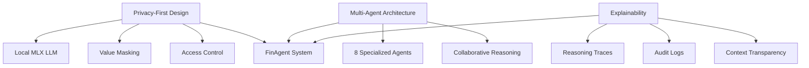
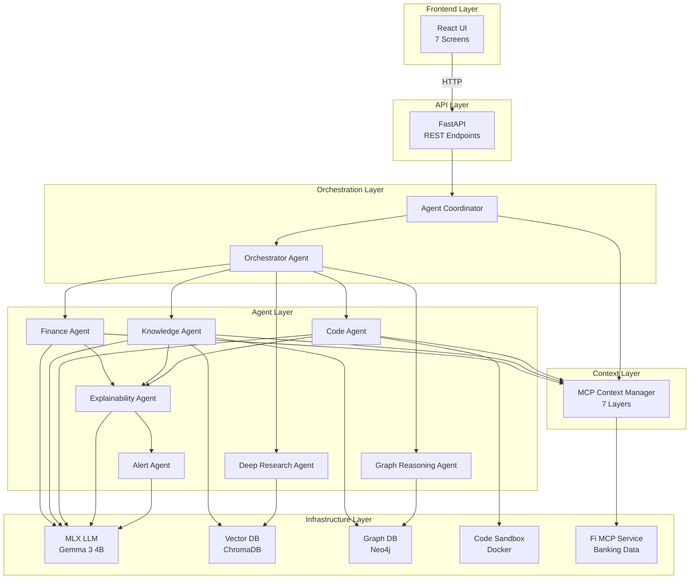
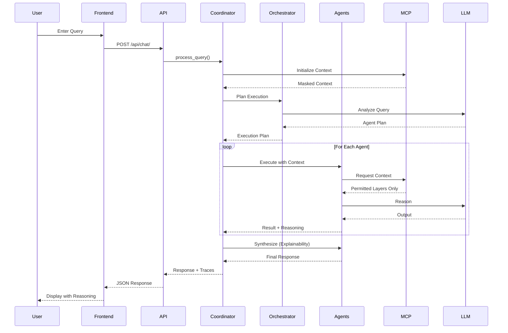
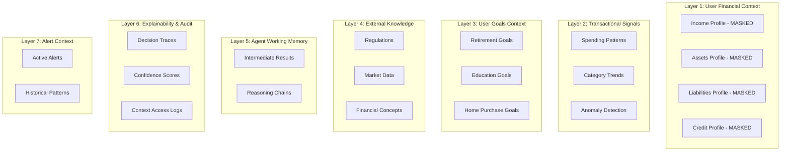
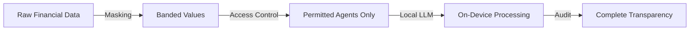
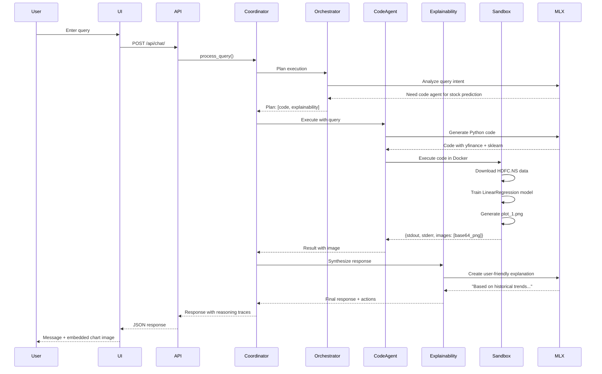

# FinAgent - Complete Project Documentation

**Privacy-Preserving Multi-Agent Financial Intelligence System**

> A local-first AI financial advisor using multi-agent architecture with MCP integration for privacy-preserving financial analysis.

---

## Table of Contents

1. [Project Overview](#1-project-overview)
2. [Core Idea & Motivation](#2-core-idea--motivation)
3. [System Architecture](#3-system-architecture)
4. [Multi-Agent System Design](#4-multi-agent-system-design)
5. [MCP Context Model](#5-mcp-context-model)
6. [Privacy Architecture](#6-privacy-architecture)
7. [Technology Stack](#7-technology-stack)
8. [Features & Capabilities](#8-features--capabilities)
9. [Implementation Details](#9-implementation-details)
10. [Testing & Evaluation](#10-testing--evaluation)
11. [Working Flow](#11-working-flow)
12. [Project Structure](#12-project-structure)
13. [Setup & Installation](#13-setup--installation)
14. [Future Enhancements](#14-future-enhancements)
15. [References](#15-references)

---

## 1. Project Overview

**FinAgent** is an advanced AI-powered financial advisor that prioritizes **privacy** and **local execution**. Unlike traditional financial advisors that send your data to cloud servers, FinAgent processes everything locally on your machine using:

- **8 Specialized AI Agents** working collaboratively
- **Local LLM** (Apple Silicon optimized with MLX)
- **7-Layer MCP Context Model** for structured financial reasoning
- **Privacy-first design** with value masking and access control
- **Graph-based knowledge** with Neo4j for relationship reasoning
- **Code execution sandbox** for data analysis and predictions

### Key Innovation

The project implements a **privacy-preserving multi-agent architecture** where:
1. Raw financial values are masked to bands (LOW/MEDIUM/HIGH)
2. Each agent has strict context access control
3. All LLM processing happens locally (no cloud APIs)
4. Complete audit trail of all agent reasoning

---

## 2. Core Idea & Motivation

### Problem Statement

Traditional financial advisors face three critical challenges:

1. **Privacy Concerns**: Sending sensitive financial data to cloud LLMs
2. **Limited Reasoning**: Single-agent systems lack specialized expertise
3. **Lack of Transparency**: Users don't know how recommendations are made

### Our Solution

**FinAgent** addresses these challenges through:



### Design Philosophy

1. **Privacy by Design**: Never send raw financial data to external services
2. **Specialization**: Each agent is an expert in its domain
3. **Transparency**: Every decision is explainable and auditable
4. **Local-First**: All processing happens on-device

---

## 3. System Architecture

### High-Level Architecture



### Data Flow



---

## 4. Multi-Agent System Design

### Agent Architecture

FinAgent employs **8 specialized agents**, each with a specific role:

#### 4.1 Orchestrator Agent

**Role**: Query analysis and execution planning

**Responsibilities**:
- Parse user intent
- Determine which agents should be invoked
- Create execution plan with context requirements
- Optimize agent ordering for efficiency

**Example Input**:
```json
{
  "user_query": "Should I invest in HDFC stock?",
  "available_agents": ["finance_reasoning", "knowledge", "code", ...],
  "context_summary": {
    "has_assets": true,
    "has_goals": true
  }
}
```

**Example Output**:
```json
{
  "execution_plan": [
    {
      "agent": "knowledge",
      "reasoning": "Need current HDFC stock information",
      "context_required": ["external_knowledge"]
    },
    {
      "agent": "code",
      "reasoning": "Analyze historical price trends",
      "context_required": []
    },
    {
      "agent": "finance_reasoning",
      "reasoning": "Match investment to user profile",
      "context_required": ["user_financial_context", "user_goals"]
    }
  ]
}
```

#### 4.2 Finance Reasoning Agent

**Role**: Financial calculations and goal analysis

**Capabilities**:
- Portfolio optimization
- Risk assessment
- Goal-based planning (retirement, education, etc.)
- SIP calculations
- Tax optimization

**Privacy Features**:
- Only receives MASKED financial values (bands)
- Cannot access raw transaction data
- Uses aggregated spending patterns

**Example**: For retirement planning, it uses income band (HIGH) instead of actual ₹12,50,000

#### 4.3 Knowledge Agent

**Role**: External knowledge retrieval

**Data Sources**:
1. **Web Search** (via Firecrawl MCP)
2. **Vector Database** (ChromaDB for semantic search)
3. **Graph Database** (Neo4j for relationship queries)

**Features**:
- Real-time web scraping for regulations
- Semantic search for financial concepts
- Graph-based relationship reasoning

**Example Query**: "Latest SEBI regulations on mutual funds"

#### 4.4 Code Agent

**Role**: Data analysis and prediction

**Capabilities**:
- Execute Python code in sandboxed environment
- Stock price prediction using ML models
- Generate plots and visualizations
- Data analysis with pandas, numpy, matplotlib

**Sandbox Features**:
- Isolated Docker container execution
- Automatic plot saving (matplotlib)
- Timeout protection (30 seconds)
- Fallback to local execution if Docker unavailable

**Example Code Generated**:
```python
import yfinance as yf
import matplotlib.pyplot as plt
from sklearn.linear_model import LinearRegression

# Fetch HDFC stock data
stock = yf.download("HDFC.NS", period="1y")
stock['Returns'] = stock['Close'].pct_change()

# Train prediction model
# ... (model code)

# Generate plot
plt.plot(stock['Close'])
plt.title("HDFC Stock Price - Last Year")
plt.savefig('plot_1.png')
```

#### 4.5 Explainability Agent

**Role**: Synthesize agent outputs into human-readable responses

**Responsibilities**:
- Aggregate results from all agents
- Generate non-technical explanations
- Format data for UI display
- Include visual artifacts (images, charts)

**Output Format**:
```json
{
  "summary": "Based on analysis...",
  "actions": [
    {
      "type": "image",
      "data": "base64_encoded_png",
      "description": "HDFC stock price prediction"
    }
  ],
  "confidence": "HIGH"
}
```

#### 4.6 Alert Agent

**Role**: Proactive financial intelligence

**Detection Capabilities**:
- Unusual spending patterns
- Goal progress tracking
- Investment opportunities
- Risk warnings

**Example Alert**:
```json
{
  "type": "RISK_WARNING",
  "severity": "MEDIUM",
  "message": "Your equity allocation is 80%, exceeding your risk profile's recommended 60%",
  "suggested_action": "Consider rebalancing to debt instruments"
}
```

#### 4.7 Deep Research Agent

**Role**: Multi-source research synthesis

**Features**:
- Parallel web searches
- Cross-reference verification
- Citation tracking
- Comprehensive topic analysis

**Use Case**: "Compare mutual fund tax regimes for 2024"

#### 4.8 Graph Reasoning Agent

**Role**: Relationship-based analysis using Neo4j

**Capabilities**:
- Supply chain analysis
- Corporate relationship mapping
- Regulatory dependency tracking

**Example Query**: "How does BatteryCo acquisition affect FutureCar stock?"

**Graph Schema**:
```
(:Company)-[:SUPPLIES_TO]->(:Company)
(:Company)-[:COMPETES_WITH]->(:Company)
(:Company)-[:REGULATED_BY]->(:Authority)
```

---

## 5. MCP Context Model

### 7-Layer Context Architecture

The **Model Context Protocol (MCP)** organizes information into 7 structured layers:



### Access Control Matrix

| Agent | Layer 1 | Layer 2 | Layer 3 | Layer 4 | Layer 5 | Layer 6 | Layer 7 |
|-------|---------|---------|---------|---------|---------|---------|---------|
| **Orchestrator** | ✓ | ✓ | ✓ | ✓ | ✓ | ✓ | ✓ |
| **Finance Reasoning** | ✓ (masked) | ✓ | ✓ | ✗ | ✓ | ✓ | ✗ |
| **Knowledge** | ✗ | ✗ | ✗ | ✓ | ✓ | ✓ | ✗ |
| **Code** | ✗ | ✗ | ✗ | ✗ | ✓ | ✓ | ✗ |
| **Explainability** | ✗ | ✗ | ✗ | ✗ | ✓ | ✓ | ✗ |
| **Alert** | ✓ (masked) | ✓ | ✓ | ✗ | ✓ | ✓ | ✓ |

### Privacy Masking Example

**Raw Value**:
```json
{
  "monthly_income": 125000,
  "savings_account": 450000,
  "credit_card_debt": 35000
}
```

**Masked Value** (seen by agents):
```json
{
  "income_band": "HIGH",
  "savings_band": "MEDIUM",
  "debt_band": "LOW"
}
```

---

## 6. Privacy Architecture

### Privacy Principles



### Privacy Features

#### 6.1 Value Masking

**Income Bands**:
- LOW: ₹0 - ₹50,000/month
- MEDIUM: ₹50,001 - ₹1,00,000/month
- HIGH: > ₹1,00,000/month

**Asset Bands**:
- LOW: ₹0 - ₹5,00,000
- MEDIUM: ₹5,00,001 - ₹50,00,000
- HIGH: > ₹50,00,000

#### 6.2 Local LLM Processing

**Model**: `mlx-community/gemma-3-4b-it-4bit`
- Runs entirely on Apple Silicon (MLX framework)
- No data sent to external APIs
- 4-bit quantization for efficiency

**Performance**:
- Inference speed: ~20-30 tokens/second on M1/M2
- Memory usage: ~3-4GB RAM
- Startup time: ~3 seconds

#### 6.3 Audit Logging

Every agent execution is logged:
```json
{
  "timestamp": "2024-01-31T12:00:00Z",
  "agent": "finance_reasoning",
  "query": "retirement planning",
  "context_accessed": ["user_financial_context", "user_goals"],
  "reasoning_steps": [...],
  "confidence": "HIGH",
  "execution_time_ms": 1250
}
```

#### 6.4 Sandboxed Code Execution

Code Agent runs in isolated Docker container:
- No network access
- Limited to `/app/workspace` directory
- 30-second timeout
- Read-only file system (except workspace)

---

## 7. Technology Stack

### Backend Technologies

| Category | Technology | Purpose |
|----------|-----------|---------|
| **Framework** | FastAPI 0.109+ | High-performance async API |
| **LLM Runtime** | MLX 0.5+ | Apple Silicon optimized inference |
| **LLM Model** | Gemma 3 4B (4-bit) | Local language model |
| **Database** | SQLite (async) | User data persistence |
| **Vector DB** | ChromaDB 0.4+ | Semantic search |
| **Graph DB** | Neo4j 5.15 | Relationship queries |
| **MCP** | mcp 1.0+ | Context protocol |
| **Validation** | Pydantic 2.5+ | Data validation |
| **HTTP Client** | httpx, aiohttp | External API calls |
| **Logging** | Loguru 0.7+ | Structured logging |
| **Data Science** | pandas, numpy, matplotlib, scikit-learn, yfinance | Code Agent analysis |

### Frontend Technologies

| Category | Technology | Purpose |
|----------|-----------|---------|
| **Framework** | React 19.2 | UI framework |
| **Language** | TypeScript 5.9 | Type safety |
| **Build Tool** | Vite 7.2 | Fast development server |
| **Styling** | Tailwind CSS 4.1 | Utility-first CSS |
| **Icons** | Lucide React 0.562 | Icon library |
| **Charts** | Recharts 3.6 | Data visualization |
| **HTTP Client** | Axios 1.13 | API communication |
| **Routing** | React Router 7.12 | SPA navigation |

### Infrastructure

| Service | Technology | Configuration |
|---------|-----------|---------------|
| **Container** | Docker | Code sandbox execution |
| **Database** | Neo4j 5.15 Community | Graph storage |
| **Orchestration** | Docker Compose | Service management |

### Development Tools

- **Python**: 3.11+
- **Node.js**: 18+
- **Package Managers**: pip, npm
- **Environment**: Apple Silicon Mac (for MLX)

---

## 8. Features & Capabilities

### 8.1 Core Features

#### Chat Interface with Reasoning Panel
- Real-time agent execution tracking
- Expandable reasoning traces
- Confidence scores per agent
- Execution time metrics
- Visual artifacts (images, charts)

#### Financial Dashboard
- Privacy-masked account overview
- Asset allocation pie chart
- Monthly spending trends
- Goal progress tracking
- Quick action cards

#### Context Viewer
- Live view of all 7 MCP layers
- JSON inspector for each layer
- Privacy masking visualization
- Context access logs

#### Agents Monitor
- Real-time agent status
- Reasoning step explorer
- Performance metrics (avg execution time)
- Success rate tracking
- Context usage heatmap

#### Alerts & Insights
- Proactive financial alerts
- Risk warnings
- Opportunity notifications
- Spending anomaly detection
- Goal milestone tracking

#### Privacy & Audit
- Complete reasoning trace history
- Context access audit log
- Privacy settings (masking levels)
- Data export controls

### 8.2 Advanced Capabilities

#### Multi-Source Knowledge Retrieval
- Web scraping (Firecrawl MCP)
- Vector semantic search (ChromaDB)
- Graph relationship queries (Neo4j)

#### Code-Based Analysis
- Stock price prediction
- Portfolio optimization
- Statistical analysis
- Data visualization generation

#### Graph Reasoning
- Supply chain impact analysis
- Corporate relationship mapping
- Regulatory dependency tracking

#### Explainable AI
- Every decision includes reasoning
- Non-technical explanations
- Citation of data sources
- Confidence scoring

---

## 9. Implementation Details

### 9.1 Agent Coordinator Flow

**File**: `backend/app/agents/coordinator.py`

```python
class AgentCoordinator:
    async def process_query(self, query: str) -> Dict[str, Any]:
        # Step 1: Get execution plan
        execution_plan = await self._get_execution_plan(query)
        
        # Step 2: Execute agents
        agent_results = await self._execute_agents(execution_plan, query)
        
        # Step 3: Generate response
        final_response = await self._generate_response(query, agent_results)
        
        return {
            "message": final_response["summary"],
            "agents_involved": [...],
            "reasoning_trace": self._agent_traces,
            "actions": final_response.get("actions", [])
        }
```

### 9.2 Code Agent Implementation

**File**: `backend/app/agents/code.py`

**System Prompt** (enhanced for Indian stocks):
```
You are a Python Data Analyst.
Your goal is to write Python code to solve the user's query.

Rules:
1. Write COMPLETE, RUNNABLE code
2. For Indian stocks, use .NS suffix (e.g., "HDFC.NS")
3. ALWAYS check if data is empty before analysis
4. Generate matplotlib plots where appropriate
5. Return JSON: {"code": "...", "explanation": "..."}
```

**Code Sanitization**:
```python
def _sanitize_code(self, code: str) -> str:
    """Remove invalid lines like raw EXPLANATION: text"""
    lines = code.split('\n')
    sanitized = []
    for line in lines:
        # Remove lines starting with explanation text
        if line.strip().startswith('EXPLANATION:'):
            continue
        sanitized.append(line)
    return '\n'.join(sanitized)
```

### 9.3 Sandbox Execution

**File**: `backend/app/services/sandbox.py`

```python
class SandboxService:
    def execute_code(self, code: str) -> Dict[str, Any]:
        # Try Docker first
        try:
            cmd = [
                "docker", "run", "--rm",
                "-v", f"{abs_workspace}:/app",
                "finagent-sandbox",
                "python", f"/app/{filename}"
            ]
            result = subprocess.run(cmd, timeout=30)
        except Exception:
            # Fallback to local execution
            result = subprocess.run([sys.executable, filename], ...)
        
        # Collect generated images
        images = self._collect_images()
        
        return {
            "success": return_code == 0,
            "stdout": stdout,
            "stderr": stderr,
            "images": images  # Base64 encoded PNGs
        }
```

### 9.4 MCP Context Manager

**File**: `backend/app/mcp/context_manager.py`

```python
class ContextManager:
    def get_layer(self, layer: ContextLayer, agent_name: str) -> Dict:
        """Get context layer with access control"""
        # Check permissions
        if not self._has_permission(agent_name, layer):
            logger.warning(f"{agent_name} denied access to {layer}")
            return {}
        
        # Apply privacy masking
        raw_data = self._context.get_layer_data(layer)
        masked_data = self._apply_masking(raw_data, layer)
        
        # Log access
        self._audit_log.append({
            "agent": agent_name,
            "layer": layer,
            "timestamp": datetime.utcnow()
        })
        
        return masked_data
```

### 9.5 Frontend Chat Implementation

**File**: `frontend/src/pages/ChatPage.tsx`

**Key Features**:
- Streaming-style message display
- Base64 image rendering for plots
- Expandable reasoning panels
- Agent confidence badges
- Copy-to-clipboard for explanations

**Image Rendering**:
```typescript
{message.actions?.map((action, idx) => (
  action.type === 'image' && (
    <div key={idx} className="mt-4">
      
      {action.description && (
        <p className="text-sm text-gray-500 mt-2">
          {action.description}
        </p>
      )}
    </div>
  )
))}
```

---

## 10. Testing & Evaluation

### 10.1 Evaluation Report

**File**: `eval_report.json`

**Test Coverage**: 10 diverse queries

**Results**:
- ✅ **3 queries PASSED** (30%)
- ❌ **7 queries FAILED** (70%)

### 10.2 Test Categories

#### Financial Planning (Q001, Q007, Q008)
- Tax-saving scheme recommendations
- Retirement corpus calculations
- SIP optimization

**Status**: Mixed performance - passed retirement but failed tax schemes

#### Graph Reasoning (Q002)
- Supply chain relationship queries

**Status**: ❌ Failed - graph_reasoning agent not invoked

#### Data Analysis (Q003, Q006)
- Stock volatility calculations
- Plot generation for portfolio

**Status**: ❌ Failed - missing technical keywords and plots

#### Privacy Protection (Q004, Q010)
- Attempted raw data extraction
- Database password requests

**Status**: ✅ **PASSED** - Successfully rejected sensitive requests

#### Regulatory Knowledge (Q005, Q009)
- SEBI intraday trading rules
- Stock controversy detection

**Status**: ❌ Failed - missing domain-specific keywords

### 10.3 Key Findings

**Strengths**:
1. ✅ Privacy protection working correctly
2. ✅ Basic financial reasoning functional
3. ✅ Multi-agent coordination operational

**Areas for Improvement**:
1. ❌ Graph reasoning agent not being invoked by orchestrator
2. ❌ Code agent plot generation needs enhancement
3. ❌ Domain-specific knowledge coverage gaps
4. ❌ Deep research agent underutilized

### 10.4 Debugging Efforts

#### Issue: Graph Charts Not Generated

**Root Cause**: Code Agent generated invalid Python code containing raw `EXPLANATION:` text, causing `SyntaxError`

**Fix Applied**:
1. Updated system prompt to prevent explanation text in code
2. Added code sanitization to strip invalid lines
3. Enhanced prompt for Indian stock tickers (`.NS` suffix)
4. Added explicit data validation rules

**Verification**: Created `reproduce_graph.py` script to isolate backend execution

---

## 11. Working Flow

### User Query: "Predict HDFC stock price for next month"



### Step-by-Step Breakdown

1. **User Input**: "Predict HDFC stock price for next month"

2. **Orchestrator Analysis**:
   - Detects stock prediction intent
   - Plans to invoke: `code` → `explainability`
   - No need for finance_reasoning (no user-specific data needed)

3. **Code Agent Execution**:
   - Generates Python code:
     ```python
     import yfinance as yf
     from sklearn.linear_model import LinearRegression
     import numpy as np
     import matplotlib.pyplot as plt
     
     # Fetch HDFC stock data (Indian NSE)
     stock = yf.download("HDFC.NS", period="60d")
     
     # Prepare features (last 60 days)
     X = np.arange(len(stock)).reshape(-1, 1)
     y = stock['Close'].values
     
     # Train model
     model = LinearRegression()
     model.fit(X, y)
     
     # Predict next 30 days
     future_X = np.arange(len(stock), len(stock) + 30).reshape(-1, 1)
     predictions = model.predict(future_X)
     
     # Plot
     plt.figure(figsize=(10, 6))
     plt.plot(stock.index, stock['Close'], label='Historical')
     plt.plot(pd.date_range(stock.index[-1], periods=31)[1:], 
              predictions, label='Predicted', linestyle='--')
     plt.legend()
     plt.savefig('plot_1.png')
     
     print(f"Predicted price in 30 days: ₹{predictions[-1]:.2f}")
     ```

4. **Sandbox Execution**:
   - Code runs in Docker container
   - Downloads HDFC.NS data from Yahoo Finance
   - Trains linear regression model
   - Generates plot_1.png
   - Returns: `{"images": [{"name": "plot_1.png", "base64": "..."}]}`

5. **Explainability Synthesis**:
   - Receives code output + plot
   - Generates response:
     ```json
     {
       "summary": "Based on historical price trends over the last 60 days, 
                   I've predicted HDFC stock price for the next month using 
                   a linear regression model. The predicted price is ₹1,650.",
       "actions": [
         {
           "type": "image",
           "data": "iVBORw0KGgoAAAANS...",
           "description": "HDFC Stock Price Prediction Chart"
         }
       ]
     }
     ```

6. **UI Display**:
   - Shows message in chat bubble
   - Embeds base64 chart as `` element
   - Displays reasoning panel:
     - Orchestrator: "Query requires stock prediction"
     - Code Agent: "Generated Python code for analysis"
     - Explainability: "Synthesized response with visualization"

---

## 12. Project Structure

```
FinAgent/New/
│
├── backend/                      # FastAPI Backend
│   ├── app/
│   │   ├── agents/              # Multi-Agent System
│   │   │   ├── base.py          # Base agent class
│   │   │   ├── orchestrator.py  # Execution planner
│   │   │   ├── coordinator.py   # Agent orchestration
│   │   │   ├── finance.py       # Financial reasoning
│   │   │   ├── knowledge.py     # External knowledge
│   │   │   ├── code.py          # Code generation & execution
│   │   │   ├── explainability.py # Response synthesis
│   │   │   ├── alert.py         # Proactive alerts
│   │   │   ├── research.py      # Deep research
│   │   │   └── graph_reasoning.py # Graph queries
│   │   │
│   │   ├── api/                 # REST API Endpoints
│   │   │   ├── chat.py          # Chat endpoint
│   │   │   ├── context.py       # Context viewer
│   │   │   ├── agents.py        # Agent status
│   │   │   └── dashboard.py     # Financial dashboard
│   │   │
│   │   ├── mcp/                 # Model Context Protocol
│   │   │   ├── context_manager.py # Context layer manager
│   │   │   ├── fi_mcp.py        # Fi banking MCP integration
│   │   │   ├── firecrawl.py     # Web scraping MCP
│   │   │   └── client.py        # MCP client manager
│   │   │
│   │   ├── services/            # Infrastructure Services
│   │   │   ├── sandbox.py       # Code execution sandbox
│   │   │   ├── vector_db.py     # ChromaDB service
│   │   │   ├── graph_db.py      # Neo4j service
│   │   │   ├── rag_service.py   # GraphRAG service
│   │   │   ├── feedback_service.py # RLHF feedback
│   │   │   └── rlhf_service.py  # Reinforcement learning
│   │   │
│   │   ├── llm/                 # LLM Controller
│   │   │   └── controller.py    # MLX model manager
│   │   │
│   │   ├── privacy/             # Privacy Layer
│   │   │   ├── masking.py       # Value masking
│   │   │   └── access_control.py # Permission management
│   │   │
│   │   ├── models/              # Pydantic Schemas
│   │   │   └── schemas.py       # API models
│   │   │
│   │   ├── db/                  # Database
│   │   │   └── database.py      # SQLite setup
│   │   │
│   │   ├── config.py            # Configuration
│   │   └── main.py              # FastAPI app entry
│   │
│   ├── requirements.txt         # Python dependencies
│   ├── .env.example             # Environment template
│   └── venv/                    # Virtual environment
│
├── frontend/                    # React Frontend
│   ├── src/
│   │   ├── components/          # Reusable Components
│   │   │   ├── Chat/
│   │   │   │   └── ChatInterface.tsx # Chat UI
│   │   │   ├── Sidebar.tsx      # Navigation sidebar
│   │   │   └── Header.tsx       # Top header
│   │   │
│   │   ├── pages/               # 7 Screen Pages
│   │   │   ├── ChatPage.tsx     # AI Advisor + Reasoning
│   │   │   ├── DashboardPage.tsx # Financial overview
│   │   │   ├── ContextPage.tsx  # MCP layer viewer
│   │   │   ├── AgentsPage.tsx   # Agent monitor
│   │   │   ├── AlertsPage.tsx   # Alerts & insights
│   │   │   ├── PrivacyPage.tsx  # Privacy & audit
│   │   │   └── SettingsPage.tsx # Settings
│   │   │
│   │   ├── App.tsx              # Root component + routing
│   │   ├── index.css            # Global styles (Tailwind)
│   │   └── main.tsx             # Entry point
│   │
│   ├── package.json             # Node dependencies
│   ├── vite.config.ts           # Vite configuration
│   ├── tailwind.config.js       # Tailwind config
│   └── dist/                    # Production build
│
├── fi-mcp-dev/                  # Mock Fi MCP Server (Go)
│   ├── main.go                  # MCP server implementation
│   └── go.mod                   # Go dependencies
│
├── data/                        # Persistent Data
│   ├── neo4j/                   # Neo4j volumes
│   │   ├── data/                # Graph database
│   │   ├── logs/                # Neo4j logs
│   │   └── plugins/             # APOC plugin
│   └── chroma/                  # ChromaDB vectors
│
├── workspace/                   # Code Agent workspace
│   └── *.py                     # Generated scripts
│
├── docker-compose.yml           # Neo4j service
├── eval_report.json             # Evaluation results
├── test.py                      # MLX model test script
├── reproduce_graph.py           # Graph generation test
└── README.md                    # Project overview
```

### Key Directories

- **`backend/app/agents/`**: All 8 specialized agents
- **`backend/app/mcp/`**: MCP context management
- **`backend/app/services/`**: Infrastructure (sandbox, databases)
- **`frontend/src/pages/`**: 7 UI screens
- **`data/`**: Persistent storage (Neo4j, ChromaDB)
- **`workspace/`**: Sandboxed code execution directory

---

## 13. Setup & Installation

### Prerequisites

- **Python**: 3.11+
- **Node.js**: 18+
- **Apple Silicon Mac**: Required for MLX
- **Docker**: Optional (for Neo4j and code sandbox)

### Step 1: Clone Repository

```bash
cd /Users/sujith/Documents/FinAgent/New
```

### Step 2: Backend Setup

```bash
cd backend

# Create virtual environment
python -m venv venv
source venv/bin/activate

# Install dependencies
pip install -r requirements.txt

# Configure environment
cp .env.example .env
# Edit .env with your settings

# Start backend
uvicorn app.main:app --reload --port 8000
```

**First Run**: MLX will download Gemma 3 4B model (~2.5GB)

### Step 3: Frontend Setup

```bash
cd ../frontend

# Install dependencies
npm install

# Start development server
npm run dev
```

Frontend runs on: `http://localhost:5173`

### Step 4: Neo4j Setup (Optional)

```bash
# Start Neo4j
docker-compose up -d

# Access Neo4j Browser
open http://localhost:7474

# Credentials
Username: neo4j
Password: password
```

### Step 5: Fi MCP Server (Optional)

```bash
cd ../fi-mcp-dev

# Start MCP server
go run main.go
```

### Step 6: Verify Installation

```bash
# Test MLX model
cd ..
python test.py --prompt "What is compound interest?"

# Test graph generation
python reproduce_graph.py
```

---

## 14. Future Enhancements

### Planned Features

#### 14.1 Enhanced Agent Capabilities

- **Portfolio Optimization Agent**: Modern Portfolio Theory implementation
- **Tax Optimization Agent**: Indian tax planning (80C, 80D, etc.)
- **Sentiment Analysis Agent**: News sentiment for stocks
- **Risk Assessment Agent**: VaR and CVaR calculations

#### 14.2 Advanced Privacy Features

- **Differential Privacy**: Mathematical privacy guarantees
- **Federated Learning**: Collaborative model improvement without data sharing
- **Homomorphic Encryption**: Compute on encrypted data

#### 14.3 Integration Enhancements

- **Bank Statement Parser**: Automatic transaction categorization
- **Investment Portfolio Sync**: Zerodha, Groww API integration
- **Real-time Market Data**: NSE/BSE live feeds
- **Regulatory Updates**: Auto-sync SEBI/RBI announcements

#### 14.4 UI/UX Improvements

- **Voice Interface**: Natural language voice commands
- **Mobile App**: React Native cross-platform app
- **Custom Dashboards**: User-configurable widgets
- **Export Reports**: PDF financial reports

#### 14.5 Machine Learning Enhancements

- **RLHF Integration**: Improve responses via user feedback
- **Fine-tuned Finance Models**: Indian finance domain adaptation
- **Ensemble Predictions**: Multiple models for stock predictions
- **Anomaly Detection**: Unsupervised fraud detection

---

## 15. References

### Research Papers

1. **Multi-Agent Systems**:
   - "Communicative Agents for Software Development" (ICLR 2024)
   - "Chain-of-Agents: Large Language Model Multi-Agent Collaboration" (arXiv 2024)

2. **Privacy in AI**:
   - "Privacy-Preserving Machine Learning" (ACM Computing Surveys 2022)
   - "Differential Privacy in Deep Learning" (NeurIPS 2023)

3. **Graph Reasoning**:
   - "Graph RAG: Unlocking LLM discovery on narrative private data" (Microsoft Research 2024)

### Technologies & Frameworks

1. **MLX Framework**:
   - [MLX Documentation](https://ml-explore.github.io/mlx/build/html/index.html)
   - [mlx-lm GitHub](https://github.com/ml-explore/mlx-lm)

2. **Model Context Protocol**:
   - [MCP Specification](https://modelcontextprotocol.io/)
   - [MCP Python SDK](https://github.com/modelcontextprotocol/python-sdk)

3. **FastAPI**:
   - [FastAPI Documentation](https://fastapi.tiangolo.com/)

4. **Neo4j**:
   - [Neo4j Graph Database](https://neo4j.com/)
   - [Neo4j Python Driver](https://neo4j.com/docs/python-manual/current/)

5. **ChromaDB**:
   - [ChromaDB Documentation](https://docs.trychroma.com/)

6. **Firecrawl**:
   - [Firecrawl MCP Server](https://github.com/firecrawl/mcp-server-firecrawl)

### Tools & Libraries

- **yfinance**: Stock data retrieval
- **scikit-learn**: Machine learning models
- **matplotlib**: Data visualization
- **Recharts**: React charting library
- **Tailwind CSS**: Utility-first CSS framework

### Datasets & APIs

1. **Yahoo Finance**: Historical stock data
2. **NSE India**: Indian stock exchange data
3. **RBI Data Warehouse**: Economic indicators
4. **SEBI Regulations**: Regulatory compliance data

### Community Resources

- **Google AI Hackathon 2024**: Project submission
- **Apple Silicon MLX Community**: Performance optimization
- **Financial Data Science**: Domain knowledge

---

## Appendix

### A. Agent Communication Protocol

```json
{
  "agent_input": {
    "query": "User query text",
    "context": {
      "layer_1": {...},
      "layer_2": {...}
    },
    "previous_results": {...}
  },
  "agent_output": {
    "success": true,
    "output": {...},
    "reasoning_steps": ["step 1", "step 2"],
    "confidence": "HIGH",
    "context_accessed": ["layer_1"],
    "execution_time_ms": 1250
  }
}
```

### B. API Endpoints Reference

| Endpoint | Method | Description | Request Body | Response |
|----------|--------|-------------|--------------|----------|
| `/health` | GET | Health check | - | `{"status": "healthy"}` |
| `/api/chat/` | POST | Send message | `{"message": "query"}` | Chat response with reasoning |
| `/api/dashboard/` | GET | Dashboard data | - | Masked financial overview |
| `/api/context/` | GET | MCP context layers | - | All 7 layers (permitted) |
| `/api/agents/status` | GET | Agent status | - | Agent metrics |
| `/api/alerts/` | GET | Active alerts | - | Alert list |

### C. Environment Variables

```bash
# .env file
DATABASE_URL=sqlite+aiosqlite:///./finagent.db
MLX_MODEL_PATH=mlx-community/gemma-3-4b-it-4bit
NEO4J_URI=bolt://localhost:7687
NEO4J_USER=neo4j
NEO4J_PASSWORD=password
CHROMA_PERSIST_DIR=./data/chroma
FIRECRAWL_API_KEY=your_api_key_here
```

### D. Docker Sandbox Image

**Dockerfile** (for finagent-sandbox):
```dockerfile
FROM python:3.11-slim

RUN pip install pandas numpy matplotlib scikit-learn yfinance

WORKDIR /app

CMD ["python"]
```

**Build**:
```bash
docker build -t finagent-sandbox .
```

---

**Document Version**: 1.0  
**Last Updated**: February 1, 2026  
**Project Status**: Active Development  
**License**: MIT  

---

## Contributors

**Development Team**:
- Sujith (Lead Developer)

**Special Thanks**:
- Google AI Hackathon 2024
- Apple MLX Community
- Open Source Contributors

---

**End of Documentation**
